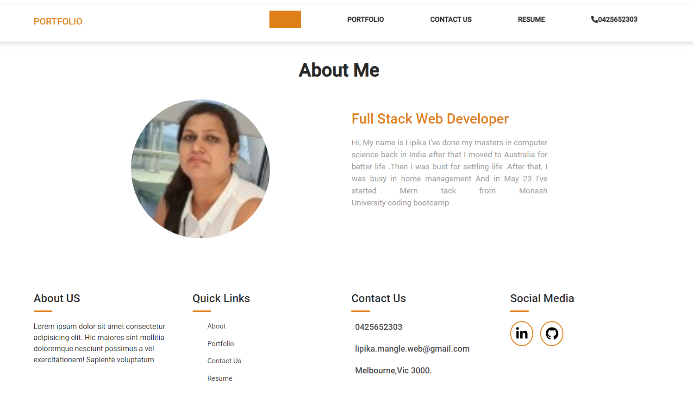
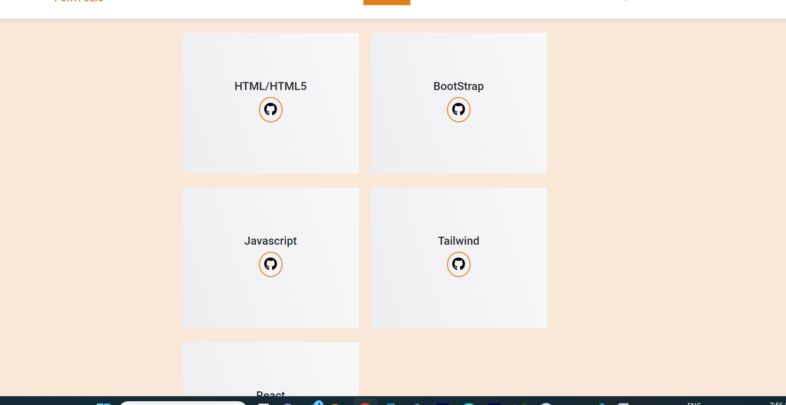
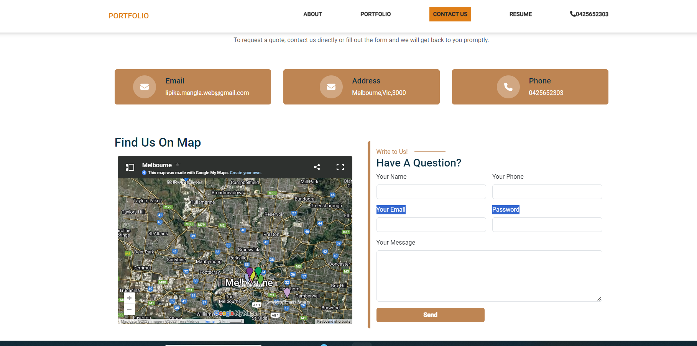
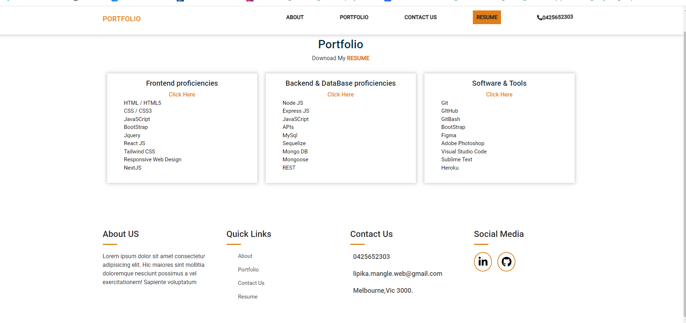

# portfolio

# Description
This is portfolio where you can see all information and your experience where did you work before or doing . I have  created single page application in react where we can see projects ,about, resume and all  our skills .i have use the package json server for contact page when user fill all fields then all information store into db.json file .In this way we can see who wants to contact us .i have created the link where you can redirect to github and other resources

## Table of Contents

  
* [Description](#Description)

* [Screenshots](#Screenshots) 

* [Technologies-Used](#Technologies-Used)

* [Features](#Features)   

* [Installation](#installation)
  
* [Instructions](#Instructions) 
          
* [License](#license)

### Screenshots

# About Page

# portfolio Page

# Contact Page

# Resume Page

### Technologies-Used
  * Express.js
 * react-fontawesome
   * bootstrap
   * json-server
  *  react-toastify

### Installing

* To install this code, download the zip file, or use GitHub's guidelines to clone the repository. 
* Clone the repository from GitHub
* To install dependiencs,run command npm i
* Run npm run dev to start 
* for server npm run server

## Instructions
If you would like to see how to create this aplication then you can check my github repo and let you know  how to cretae it

## License
This application is covered under the MIT license

## Questions
Created by: LipikaManglaa

If you have any further questions please feel free to contact me at lipika.mangla.web@gmail.com